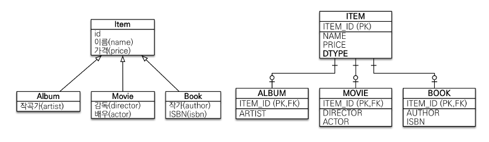
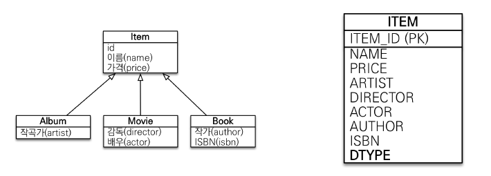
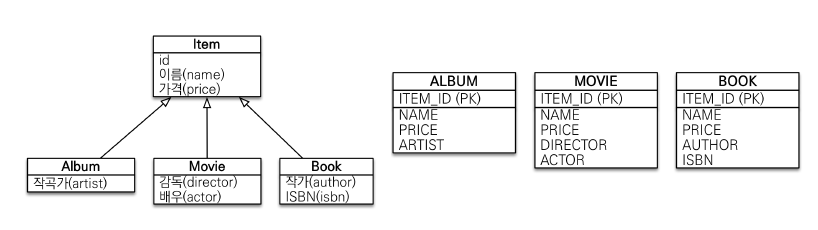
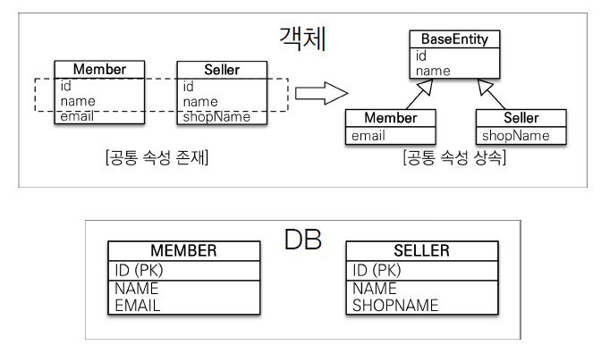

# 20210922_Initialize Project
- Maven 사용
  - resources/META-INF/persistence.xml : 설정 파일
  - pom.xml : Maven 외부 라이브러리 및 버전 관리

# 20210923_영속성 관리 - 내부 동작 방식
### 영속성 컨텍스트(Persistence Context)
- 엔티티를 영구 저장하는 환경
- EntityManager -> PersistenceContext(1차 캐시?) 접근
  - EntityManager.persist(entity);
- 엔티티의 생명주기
  - 비영속(new/transient)
    - 영속성 컨텍스트와 전혀 관계 없는 새로운 상태
  - 영속(managed)
    - 영속성 컨텍스트에 관리되는 상태
  - 준영속(detached)
    - 영속성 컨텍스트에 저장되었다가 분리된 상태
    - 영속성 컨텍스트가 제공하는 기능 사용하지 못함
  ````java
  em.detach(entity); //특정 엔티티만 분리
  em.clear(); //영속성 컨텍스트 모두 초기화 
  em.close(); //영속성 컨텍스트 종료
  ````
  - 삭제(removed)
    - 삭제된 상태
- 영속적 컨텍스트의 이점
  - 1차 캐시
  - 동일성(identity) 보장
    - 1차 캐시로 반복 가능한 읽기(Repeatable Read) 등급의 트랜잭션 격리 수준을 DB가 아닌 애플리케이션 차원에서 제공
  - 트랙잭션을 지원하는 쓰기 지연(transactional write-behind)
    - DB에 반영할 SQL을 생성하여 entityManager의 쓰기 지연 SQL 저장소에 쌓아둠 (batch 옵션 이용하여 제한을 둘 수 있음)
  ````java
  EntityManager em = emf.createEntityManager();
  EntityTransaction tx = em.getTransaction();
  tx.begin();
  
  em.persist(memberA);
  em.persist(memberB)
  //여기까지 INSERT SQL을 DB에 보내지 않음
  
  //커밋하는 순간 DB에 INSERT SQL을 보냄
  tx.commit();
  ````
  - 변경 감지(Dirty Checking)
    - 영속 엔티티를 조회하여 수정할 때, 1차 캐시의 엔티티와 스냅샷(영속성 컨텍스트에 들어온 최초 시점의 상태)을 비교하여 바뀐 부분이 있으면 UPDATE 쿼리를 쓰기 지연 SQL 저장소에 저장
    - 플러시 (flush): 영속성 컨텍스트의 변경 내용을 DB에 반뎡
      1. 변경감지 
      2. 수정된 엔티티 쓰기 지연 SQL 저장소에 등록
      3. 쓰기 지연 SQL 저장소의 쿼리를 DB에 전송(등록, 수정, 삭제 쿼리)
      - em.flush : 직접 호출(거의 사용하지 않음)
      - 트랜잭션 커밋, JPQL 쿼리 실행 : 플러시 자동 호출
      - 영속성 컨텍스트를 비우지 않음
      - 영속성 컨텍스트의 변경 내용을 DB에 동기화 하는 것
      - 트랜잭션이라는 작업 단위가 중요 -> 커밋 직전에만 동기화 하면 됨
  ````java
  Member findMember = em.find(Member.class, 2L);
  findMember.setName("user2"); // User2 -> user2
  
  //em.persist(findMember); 없어도 동작함
  ````
  - 지연 로딩(Lazy Loadingg)
  

# 20210924_엔티티 매핑
- 객체 @Entity : JPA가 관리하는 엔티티
  - 기본 생성자 필수
  - final 클래스, enum, interface, inner 클래스 사용 X
  - 저장할 필드에 final 사용 X
  - 속성 : name
    - JPA에서 사용할 엔티티 이름 지정
    - 기본값 : 클래스 이름 그대로 사용
    - 같은 클래스 이름이 없으면 가급적 기본값 사용한다
- 테이블 @Table
- 필드, 컬럼 @Column
- 기본 키 @Id
- 연관관계 @ManyToOne, @JoinColumn

### 데이터베이스 스키마 자동 생성
- DDL을 애플리케이션 실행 시점에 자동 생성
- 테이블 중심 -> 객체 중심
- 데이터베이스에 맞는 적절한 DDL 생성
- 생성된 DDL은 개발 장비에서만 사용하고, 운영 서버에서는 사용하지 않거나 적절히 다듬은 후 사용할 것 
  - 운영 장비에서는 절대 create, create-drop, update 사용 X
- hibernate.hbm2ddl.auto
  - create : 기존 테이블 삭제 후 다시 생성 (DROP + CREATE)
  - create-drop : create와 같으나 종료시점에 테이블 DROP
  - update : 변경분만 반영(운영 DB 사용 금지)
  - validate : 엔티티와 테이블이 정상 매핑되었는지만 확인
  - none : 사용하지 않음

### DDL 생성 기능
- 제약 조건 추가 
  - @Column(nullable = false, length = 10) : 필수 항목, 10자 초과 X
  - DDL 생성 기능에만 사용되고 JPA 실행 로직에는 영향 X

# 20210925_필드와 컬럼 매핑

````java
@Entity
//@Table(name = "MEMBER")
public class Member {
    @Id
    private Long id;

    @Column(name = "name")
    private String username;

    private Integer age;

    @Enumerated(EnumType.STRING) // ENUM 사용시
    private RoleType roleType;

    @Temporal(TemporalType.TIMESTAMP) // TemporalType 사용시 : Date, TIME, TIMESTAMP
    private Date createdDate;

    @Temporal(TemporalType.TIMESTAMP)
    private Date lastModifiedDate;

    @Lob // VARCHAR 보다 긴 문장
    private String description;
}
````
=>
create table Member (
id bigint not null,
age integer,
createdDate timestamp,
description clob,
lastModifiedDate timestamp,
roleType varchar(255),
name varchar(255),
primary key (id)
)

- @Column : 컬럼 매핑
  - name : 필드와 매핑할 테이블의 컬럼 이름 (default: 객체 필드 이름)
  - insertable, updatable : 등록, 변경 여부 (default: TRUE)
  - nullable(DDL) : null 값 허용 여부 설정. false로 설정하면 DDL 생성 시 not null 제약 조건 붙음.
  - unique(DDL) : @Table의 uniqueConstraints와 같지만 한 컬럼에 간단히 유니크 제약조건을 걸 때 사용한다. 단 유니크 컬럼의 이름은 랜덤으로 지정되니 사용하지 않음.
  - columnDefinition(DDL) : 데이터 베이스 컬럼 정보를 직접 줄 수 있음. 
    - ex) columnDefinition = "varchar(100) default 'EMPTY'"
  - length(DDL) : 문자 길이 제약 조건, String 타입에만 사용
  - precision, scale(DDL) : BigDecimal/BigInteger 타입에서 사용.
    - precision : 소수점을 포함한 전체 자릿수
    - scale : 소수의 자릿수
- @Temporal : 날짜 타입 매핑. LocalDate, LocalDateTime 사용 시에는 생략 가능
  - TemporalType.TIME, TemporalType.DATE, TemporalType.TIMESTAMP
- @Enumerated : enum 타입 매핑
    - EnumType.ORDINAL : enum 순서를 DB에 저장. 사용 X
    - EnumType.STRING : enum 이름을 DB에 저장
- @Lob : BLOB, CLOB 매핑.
  - BLOB : 매핑하는 문자열이 String이 아닌 경우 자동 지정
  - CLOB : 매핑하는 문자열이 String인 경우 자동 지정
- @Transient : 특정 필드를 매핑에서 제외
  - DB 저장 및 조회 X
  - 주로 메모리상에서만 임시로 어떤 값을 보관하고 싶을 때 사용
  
# 20210926_기본 키 매핑
- @Id : 직접 할당
- @GeneratedValue : 자동 생성 ex) @GeneratedValue(strategy = GenerationType.AUTO)
  - AUTO : 방언에 따라 자동 지정, 기본값 
  
  - IDENTITY : 데이터베이스에 위임, MYSQL
    - 이 경우, commit 이전에 insert 쿼리가 날아감(DB에 접근하기 전까지 PK를 알 수 없기 때문에)
  
  - SEQUENCE : 데이터베이스 시퀀스 오브젝트 사용, ORACLE
    - @SequenceGenerator 필요
      - sequenceName : DB에 등록되어 있는 시퀀스 이름
      - initialValue : DDL 생성 시에만 사용, 시퀀스 DDL을 생성할 때 처음 1로 시작하는 수 지정
      - allocationSize(default: 50) : 시퀀스 한 번 호출에 증가하는 수(성능 최적화에 사용됨). DB 시퀀스 값이 하나씩 증가하도록 설정되어 있으면 이 값을 반드시 1로 설정해야 함.
      - catalog, schema : DB catalog, schema 이름
```java
        @Entity
        @SequenceGenerator(name = "member_seq_generator", 
                           sequenceName = "member_Seq")
        public class Member {

        @Id
        @GeneratedValue(strategy = GenerationType.SEQUENCE, generator = "member_seq_generator") // AUTO(default)
        private Long id;
        
        }
```
- 
  - TABLE : 키 생성용 테이블 사용, 모든 DB에서 사용
    - 장점 : 모든 DB에 적용 가능
    - @TableGenerator 필요
      - name(필수) : 식별자 생성기 이름
      - table(hibernate_sequences) : 키 생성 테이블명
      - pkColumnName(sequence_name) : 시퀀스 컬럼명
      - valueColumnNa(next_val) : 시퀀스 값 컬럼명
      - pkColumnValue(엔티티 이름) : 키로 사용할 값 이름
      - initialValue(0) : 초기값, 마지막으로 생성된 값 기준
      - allocationSize(50) : 시퀀스 한 번 호출에 증가하는 수(성능 최적화에 사용)
      - catalog, schema : DB catalog, schema 이름
      - uniqueConstraints(DDL) : 유니크 제약 조건 지정
```java
@Entity
@TableGenerator(name = "MEMBER_SEQ_GENERATOR",
                table = "MY_SEQUENCES",
                pkColumnValue = "MEMBER_SEQ", allocationSize = 1)
public class Member {
    
@Id
@GeneratedValue(strategy = GenerationType.TABLE, generator = "MEMBER_SEQ_GENERATOR") // AUTO(default)
private Long id;
}
```

### 권장하는 식별자 전략
- 기본키 제약 조건 : NOT NULL, UNIQUE, 변하면 안된다.
- 미래까지 이 조건을  만족하는 자연키는 찾기 어려움 -> 대리키(대체키) 사용
- 권장 : Long + 대체키 + 키 생성 전략 사용

### 단방향 연관관계
- 방향(Direction): 단방향, 양방향
- 다중성(Multiplicity): 다대일(N:1), 일대다(1:N), 일대일(1:1), 다대다(N:M)
- 연관관계의 주인(Owner): 객체 양방향 연관관계는 관리 필요

# 20210927_양방향 연관관계와 연관관계의 주인
- @OneToMany(mappedBy = "")
  - 객체와 테이블이 관계를 맺는 차이 이해 중요
    - 객체 연관관계 = 2개
      - 회원 -> 팀 연관관계 (단방향)
      - 팀 -> 회원 연관관계 (단방향)
    - 테이블 연관관계 = 1개
      - 회원 <-> 팀 연관관계 (양방향)

### 양방향 매핑 규칙
- 객체의 두 관계 중 하나를 연관관계의 주인으로 지정
- 연관관계의 주인만이 외래 키를 관리(등록, 수정)
- 주인이 아닌 쪽은 읽기만 가능
- 주인은 mappedBy 속성 사용 X
- 주인이 아니면 mappedBy 속성으로 주인 지정
- 누구를 주인으로?
  - 외래키가 있는 곳(N)
- 주의!
  - 연관관계의 주인에 값을 입력해야 함
    - 양방향 매핑 시 순수 객체 관계를 고려하면 양쪽 다 값을 입력해야 함
    - 연관관계 편의 메소드 생성
    ````java
    public void changeTeam(Team team) {
        this.team = team;
        team.getMembers().add(this);
    }
    ````
    - 양방향 매핑 시 무한 루프 조심
      - toStringg(), lombok, JSON 생성 라이브러리
- 정리
  - 단방향 매핑만으로도 이미 연관관계 매핑은 완료
  - 양방향 매핑은 반대 방향으로 조회(객체 그래프 탐색) 기능이 추가된 것 뿐
  - JPQL에서 역방향으로 탐색할 일이 많음
  - 단방향 매핑을 잘 하고 양방향은 필요할 때 추가해도 됨(테이블에 영향 X)

# 20210928_연관관계 매핑
- 연관관계 매핑시 고려사항
  1. 다중성
     - 다대일 : @ManyToOne
     - 일대다 : @OneToMany
     - 일대일 : @OneToOne
     - 다대다 : @ManyToMany => 실무에서 쓰면 안됨
  2. 단방향, 양방향
     - 테이블
       - 외래키 하나로 양쪽 조인 가능
       - 방향이라는 개념 존재 X
     - 객체
       - 참조용 필드가 있는 쪽으로만 참조 가능
       - 한쪽만 참조하면 단방향
       - 양쪽이 서로 참조하면 양방향
  3. 연관관계의 주인 : 외래키를 관리하는 참조
     - 테이블은 외래키 하나로 두 테이블이 연관관계를 맺음
     - 객체 양방향 관계는 A->B, B->A처럼 참조가 2군데
     - 객체 양방향 관계는 참조가 2군데 있음. 둘 중 테이블의 외래키를 관리할 곳을 지정해야 함
     - 주인의 반대편 : 외래키에 영향X, 단순 조회

### 다대일 [N:1]
- 다대일 단방향
  - 가장 많이 사용하는 연관관계
- 다대일 양방향
  - 외래키가 있는 쪽이 연관관계의 주인
  - 양쪽을 서로 참조하도록 개발

### 일대다 [1:N] -> 권장하지 않음
- 일대다 단방향
  - 일대다 단방향은 일대다(1:N)에서 1이 연관관계의 주인
  - 테이블 일대다 관계는 항상 N 쪽에 외래키가 있음
  - 객체와 테이블 차이 때문에 반대편 테이블의 외래키를 관리하는 특이한 구조
  - @JoinColumn을 꼭 사용해야 함. 그렇지 않으면 조인 테이블 방식을 사용(중간에 테이블 하나 추가)
  - 단점
    - 엔티티가 관리하는 외래키가 다른 테이블에 있음
    - 연관관계 관리를 위해 추가로 UPDATE 쿼리 실행
  - 일대다 단방향 매핑 보다는 다대일 양방향 매핑 사용할 것
main.java
````java
public class JpaMain {
    public static void main(String[] args) {
      ...
      Member member = new Member();
      member.setUsername("member1");
      em.persist(member);

      Team team = new Team();
      team.setName("TeamA");
      em.persist(team);

      team.getMembers().add(member);

      tx.commit();
      ...
    }
}
````
Member.java
````java
@Entity
public class Member {

  @Id
  @GeneratedValue
  @Column(name = "MEMBER_ID")
  private Long id;

  @Column(name = "USERNAME")
  private String username;
  ...
}
````
Team.java
````java
@Entity
public class Team {

  @Id
  @GeneratedValue
  @Column(name = "TEAM_ID")
  private Long id;
  private String name;

  @OneToMany
  @JoinColumn(name = "TEAM_ID")
  private List<Member> members = new ArrayList<>();
  ...
}
````
- 일대다 양방향
  - 공식적으로 존재 X
  - @JoinColumn(insertable=false, updatable=false)
  - 읽기 전용 필드 사용하여 양방향처럼 사용하는 것
  - 다대일 양방향을 사용하자..

### 일대일(1:1)
- 반대도 일대일
- 주 테이블이나 대상 테이블 중 외래키 선택 가능
- 외래키에 DB 유니크(UNI) 제약조건 추가
- 주 테이블에 외래키 양방향
  - 다대일 양방향 매핑처럼 외래키가 있는 곳이 연관관계의 주인
  - 반대편은 mappedBy 적용
- 대상 테이블에 외래키 단방향 : JPA 지원 X
- 주 테이블에 외래키
  - 주 객체가 대상 객체의 참조를 가지는 것 처럼 주 테이블에 외래키를 두고 대상 테이블을 찾음
  - 객체지향적
  - JPA 매핑 편리
  - 장점 : 주 테이블만 조회해도 대상 테이블에 데이터가 있는지 확인 가능
  - 단점 : 값이 없으면 외래키에 NULL 적용
- 대상 테이블에 외래키
  - 대상 테이블에 외래키 존재
  - 전통적인 DB개발자 선호
  - 주 테이블과 대상 테이블을 일대일에서 일대다 관계로 변경할 때 테이블 구조 유지
  - 단점 : 프록시 기능의 한계로 지연 로딩으로 설정해도 항상 즉시 로딩됨

### 다대다(N:M) : 실무 사용 X =>연결 테이블용 엔티티 추가(연결 테이블 엔티티로 승격)
- 관계형 DB는 정규화된 테이블 2개로 다대다 관계 표현X
- 연결 테이블을 추가하여 일대다, 다대일 관계로 풀어야 함
  - 단, 연결 테이블이 단순히 연결만 하고 끝나는 것이 아닌,
  - 주문 시간, 수량 같은 데이터가 들어올 수 있음
- 객체는 컬렉션을 사용하여 객체 2개로 다대다 관계 가능
- @ManyToMany
- @JoinTable 

# 20210929_고급매핑
### 상속관계 매핑
- 관계형 데이터베이스는 상속 관계 X
- 슈퍼타입-서브타입 관계라는 모델링 기법이 객체 상속과 유사
- 상속관계 매핑: 객체의 상속 구조와 DB의 슈퍼타입-서브타입 관계를 매핑하는 것
  - 슈퍼타입-서브타입 논리 모델을 실제 물리 모델로 구현하는 방법
    - 각각 테이블로 변환 -> 조인 전략
    
      - @Inheritance(strategy=InheritanceType.JOINED)
      - 장점
        - 테이블 정규화
        - 외래키 참조 무결성 제약조건 활용 가능
        - 저장공간 효율화
      - 단점
        - 조회 시 조인을 많이 사용, 성능 저하
        - 조회 쿼리 복잡
        - 데이터 저장시 INSERT SQL 두 번 호출
    - 통합 테이블로 변환 -> 단일 테이블 전략
    
      - @Inheritance(strategy=InheritanceType.SINGLE_TABLE) 
        - 장점
          - 조인이 필요 없어 일반적으로 조회 성능 빠름
          - 조회 쿼리 단순
        - 단점
          - 자식 엔티티가 매핑한 컬럼은 모두 null
          - 단일 테이블에 모든 것을 저장하여 테이블이 커질 수 있음. 상황에 따라 조회 성능이 오히려 느려질 수 있음
    - 서브타입 테이블로 변환 -> 구현 클래스마다 테이블 전략 ~ 쓰면 않되 ~
    
      - @Inheritance(strategy=InheritanceType.TABLE_PER_CLASS)
      - 장점
        - 서브 타입을 명확하게 구분해서 처리할 때 효과적
        - not null 제약조건 사용 가능
      - 단점
        - 여러 자식 테이블을 함께 조회할 때 성능이 느림(UNION SQL)
        - 자식 테이블을 통합해서 쿼리하기 어려움

### @MappedSuperclass : 속성만 상속
- 공통 매핑 정보가 필요할 때 사용(id, name)

- 상속 관계 매핑 X
- 엔티티 X, 테이블 매핑 X
- 부모 클래스를 상속 받는 자식 클래스에 매핑 정보만 젲공
- 조회, 검색(em.find(BaseEntity)) 불가
- 직접 생성해서 사용할 일 없으므로 추상 클래스 권장
- 전체 엔티티에서 공통으로 적용하는 정보 모을 때 사용
- @Entity 클래스는 엔티티나 @MappedSuperclass로 지정한 클래스만 상속 가능

````java
@MappedSuperclass
public abstract class BaseEntity {

  @Column(name = "INSERT_MEMBER")
  private String createdBy;
  private LocalDateTime createdTime;
  @Column(name = "UPDATE_MEMBER")
  private String lastModifiedBy;
  private LocalDateTime lastModifiedDate;
  ...
}
````

````java
@Entity
public class Team extends BaseEntity {
  ...
}
````

# 20210929_프록시
### em.find() vs em.getRefernce()
  - em.find(): DB를 통해 실제 엔티티 객체 조회
  - em.getRefernce(): DB 조회를 미루는 가짜(프록시) 엔티티 객체 조회
### 특징
  - 실제 클래스 상속 받아 만들어짐
  - 실제 클래스와 겉 모양이 같음
  - 사용하는 입장에서는 진짜 객체인지 프록시 객체인지 구분하지 않고 사용하면 됨(이론상..)
  - 프록시 객체는 실제 객체의 참조(target)를 보관
  - 프록시 객체를 호출하면 프록시 객체는 실제 객체의 메소드 호출
  - 프록시 객체는 처음 사용할 때 한 번만 초기화
  - 프록시 객체를 초기화 할 때, 프록시 객체가 실제 엔티티로 바뀌는 것이 아닌, 프록시 객체를 통해 실제 엔티티에 접근 가능한 것
  - 프록시 객체는 원본 엔티티를 상속받음, 따라서 타입 체크시 주의(==이 아닌 instance of 사용)
  - 영속성 컨텍스트에 찾는 엔티티가 이미 있으면 em.getReference()를 호출해도 실제 엔티티 반환
  - 영속성 컨텍스트의 도움을 받을 수 없는 준영속 상태일 때, 프록시를 초기화하면 문제 발생
### 프록시 확인
  - 프록시 인스턴스 초기화 여부 확인: emf.getPersistenceUnitUtil.isLoaded(Object entity)
  - 프록시 클래스 확인: entity.getClass().getName()
  - 프록시 강제 초기화: org.hibernate.Hibernate.initialize(entity);
  - 참고: JPA 표준은 강제 초기화 X. 강제 호출은 member.getName()

## 즉시 로딩과 지연 로딩
- @ManyToOne(fetch = FetchType.EAGER)
  - 예상하지 못한 SQL 발생
  - JPQL에서 N+1 문제 발생
  - @ManyToOne, @OneToOne은 기본이 즉시 로딩
- @ManyToOne(fetch = FetchType.LAZY)
  - 가급적 지연 로딩 사용(실무에서)
  - @OneToMany, @ManyToMany는 기본이 지연 로딩
  - 
### 지연 로딩 활용
- Member와 Team 자주 함께 사용 -> 즉시로딩
- Member와 Order 가끔 사용 -> 지연로딩
- Order와 Product는 자주 함께 사용 -> 즉시로딩
=> 이론적인 거.. 실무에서는 전부 지연로딩으로
- JPQL fetch 조인, 엔티티 그래프 기능 사용할 것

# 20210930_영속성 전이(CASCADE)와 고아 객체
- 특정 엔티티를 영속상태로 만들 때 연관된 엔티티도 함께 영속 상태로 만들고 싶을 때
- 하나의 부모가 자식들을 관리할 때, 라이프 사이클이 동일할 때 의미 있음 (게시판-첨부파일 데이터)
- ex) 부모 엔티티를 저장할 때 자식 엔티티도 함께 저장
- 주의
  - 연관관계 매핑과는 아무 관련 없음
  - 엔티티를 영속화할 때 연관된 엔티티도 함께 영속화하는 것 뿐
- 종류
  - ALL: 모두 적용
  - PERSIST: 영속
  - REMOVE: 삭제

### 고아 객체
- 고아 객체 제거: 부모 엔티티와 연관관계가 끊어진 자식 엔티티 자동 삭제
- orphanRemoval = true
- 주의
  - 참조가 제거된 엔티티는 다른 곳에서 참조하지 않는 고아 객체로 보고 삭제
  - 참조하는 곳이 하나일 경우에만 사용해야 함
  - 특정 엔티티가 개인 소유할 때 사용
  - @OneToOne, @OneToMany
  - 참고: 부모를 제거하면 자식은 고아가 되기 때문에, 해당 기능을 활성화하면 부모를 제거할 때 자식도 함께 제거됨

### 영속성 전이 + 고아 객체, 생명주기
- cascade = CascadeType.ALL, orphanRemoval = true
- 스스로 생명주기를 관리하는 엔티티는 em.persist()로 영속화, em.remove()로 제거
- 두 옵션 모두 활성화하면 부모 엔티티를 통해 자식의 생명주기 관리 가능
- 도메인 주도 설계(DDD)의 Aggregate Root 개념 구현 시 유용

# 20211001_기본값 타입
- JPA의 데이터 타입 분류
  - 엔티티 타입
    - @Entity로 정의하는 객체
    - 데이터가 변해도 식별자로 지속해서 추적 가능
    - ex) 회원 엔티티의 키나 나이 값을 변경해도 식별자로 인식 가능
  - 값 타입
    - int, Integer, String 처럼 단순 값으로 사용하는 자바 기본 타입이나 객체
    - 식별자가 없고 값만 있어 변경시 추적 불가
    - ex) 숫자 100을 200으로 변경하면 완전히 다른 값

### 값 타입 분류
- 기본값 타입
  - 자바 기본 타입(int, double)
  - 래퍼 클래스(Integer, Long)
  - String
  - 생명주기를 엔티티에 의존 -> 회원 삭제하면 이름, 나이 필드도 같이 삭제
  - 값 타입 공유 X -> 회원 이름 변경 시 다른 회원의 이름도 함꼐 변경되면 안됨
- 임베디드 타입(embedded type, 복합 값 타입)
- 컬렉션 값 타입(collection value type)

### 임베디드 타입

- 새로운 값 타입을 직접 정의할 수 있음
- JPA는 임베디드 타입(Embedded type)이라고 함
- 주로 기본 값 타입을 모아 만들어서 복합 값 타입이라고도 함
- int, String과 같은 값 타입
- Member [id, name, workPeriod[startDate, endDate], homeAddress[city, street, zipcode]]
- @Embeddable: 값 타입을 정의하는 곳에 표시
- @Embedded: 값 타입을 사용하는 곳에 표시
- 기본 생성자 필수
- 장점
  - 재사용
  - 높은 응집도
  - Period.isWork() 처럼 해당 값 타입만 사용하는 의미있는 메소드 만들 수 있음
  - 임베디드 타입을 포함한 모든 값 타입은 값 타입을 소유한 엔티티에 생명 주기를 의존함
- 임베디드 타입과 테이블 매핑
  - 임베디드 타입은 엔티티의 값일 뿐
  - 임베디드 타입을 사용하기 전과 후에 매핑하는 테이블은 동일
  - 객체와 테이블을 아주 세밀하게(find-grained) 매핑하는 것이 가능
  - 잘 설계한 ORM 애플리케이션은 매핑한 테이블의 수보다 클래스의 수가 더 많음

### 임베디드 타입과 연관관계
- @AttributeOverride: 속성 재정의
  - 한 엔티티에서 같은 값 타입 사용
  - 컬럼 명 중복 시
  - @AttributeOverrides, @AttributeOverride 사용하여 컬럼 명 속성 재정의
  ````java
  @Embedded
    @AttributeOverrides({
            @AttributeOverride(name = "city", column = @Column(name = "W_CITY")),
            @AttributeOverride(name = "street", column = @Column(name = "W_STREET")),
            @AttributeOverride(name = "zipcode", column = @Column(name = "W_ZIPCODE"))
    })
    private Address workAddress;
  ````